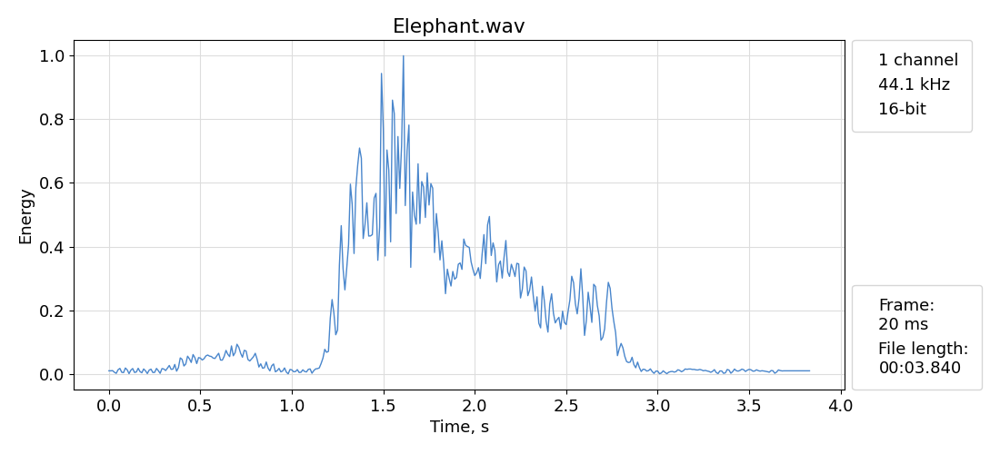

# Garso signalų apdorojimas
### Programos paskirtis

Programa atlieka garso signalo analizę laiko bei dažnių srityse. Garso signalo analizė gali būti atliekama tik su `*.wav` tipo audio failais, kuriems nuskaityti naudojama `scipy.io wavfile` biblioteka.  

Nuskaityto failo duomenys atvaizduojami naudojant `matplotlib` biblioteką.  

### Programos funkcijos
* Signalo laiko, energijos ar nulio kirtimų skaičiaus diagramų brėžimas.
* Galimybė atskirti ir grafiškai atvaizduoti signalo energijos segmentus.
* Signalo intervalo (arba pilno signalo) spektro amplitudės diagramos brėžimas.
* *Fade effect* pritaikymas garso signalui, ir jo išsaugojimas.
* Signalo spektro modifikavimas ir jo išsaugojimas.

### Programos naudojimas

1. Paleidus programą, komandinėje eilutėje pateikiamas programos meniu. Pasirinkus pirmą variantą "Open file", iššoka standartinio failo pasirinkimo dialogas, kurio pagalba pasirenkamas norimas `*.wav` tipo failas. Norint baigti programos darbą pasirenkamas "Quit" variantas.
```
MENU
 [1] Open file
 [2] Quit
> 
```
2. Toliau reikia pasirinkti kokio tipo veiksmus atlikti, arba grįžti į pagrindinį meniu.
```
FILE 'Filename.wav' MENU
 [1] Time domain plots
 [2] Fade effect
 [3] Spectrum analysis
 [0] Main menu
> 
```
3. Pasirinkus `Time domain plots`, galima pasirinkti kokio tipo diagramą brėžti. Pasirinkus `File menu` grįžtama į ankstesnį meniu.
```
'Filename.wav' time domain plot MENU
 [1] Energy plot
 [2] ZCR plot
 [3] Time plot
 [4] Segment plot
 [0] File menu
```
4. Pasirinkus `Energy`, `ZCR` diagramas, reikia papildomai nurodyti šių parametrų skaičiavimui naudojamo kadro ilgį milisekundėmis.
```
> 1
Enter frame size in ms.
> 
```
Pasirinkus `Segment` diagramą reikia nurodyti kadro ilgį bei segmentavimo slenkčio vertę.
```
> 4
Enter frame size in ms.
> 
Enter step size.
> 
```
5. Pasirinkus `Fade effect`, reikia nurodyti *fade* efekto trukmę ir pasirinkti kitimo dėsnį.
```
Audio length: 00:01.498
Enter fade time in ms:
> 100
Choose fade type:
[1] Linear
[2] Logarithmic
>
```
6. Pasirinkus `Spectrum analysis`, nurodomas signalo intervalas, kurį norima anlizuoti:
```
Audio length: 00:01.498
Enter start time.
Seconds:
> 
Audio length: 00:01.498
Enter end time.
Seconds:
> 
```
Toliau galima pasirinkti kokius veiksmus atlikti su signalo spektru:
```
Choose how to modify:
 [1] remove frequencies
 [2] add frequencies
 [3] move frequencies right
>
```
7. Energijos diagramos pvz.
