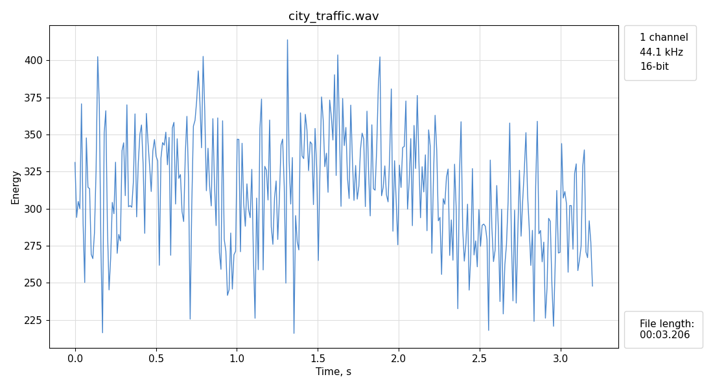

# Garso signalų apdorojimas
## 1. Garso signalų atvaizdavimas bei analizė laiko srityje

Programa naudoja `scipy.io wavfilw` biblioteką `*.wav` tipo audio failams nuskaityti.  

Nuskaityto failo duomenys atvaizduojami naudojami `matplotlib` biblioteką. Programa nustato audio failo kanalų skaičių, diskretizavimo dažnį (kilohercais) bei kvantavimo gylį (bitais). Taip pat galima apskaičiuoti signalo energiją bei nulio kirtimų skaičių.

### Naudojimasis programa

1. Paleidus programą, komandinėje eilutėje pateikiamas programos meniu. Pasirinkus pirmą variantą "Open file", iššoka standartinio failo pasirinkimo dialogas, kurio pagalba pasirenkamas norimas `*.wav` tipo failas. Norint baigti programos darbą pasirenkamas "Quit" variantas.
```
MENU
 [1] Open file
 [2] Quit
> 
```
2. Toliau reikia pasirinkti kokio tipo diagramą braižyti, arba grįžti į pagrindinį meniu.
```
FILE 'Filename.wav' MENU
 [1] Energy plot
 [2] ZCR plot
 [3] Time plot
 [4] Menu
> 
```
3. Pasirinkus `Energy` ir `ZCR` diagramas, reikia papildomai nurodyti šių parametrų skaičiavimui naudojamo kadro ilgį milisekundėmis.
```
> 1
Frame size in ms: 
```
   Pasirinkus `Time` diagramą papildomai pasirinktoje vietoje nurodomas žymeklis.
```
> 3
audio length: 00:01.498
Enter marker time:
Seconds: 
```
4. Pateikiama diagrama, kurioje atvaizduojamas garso įrašas, kartu su esminiais parametrais.  
   Pvz.
```
MENU
 [1] Open file
 [2] Quit
> 1
Processing...
FILE 'city_traffic.wav' MENU
 [1] Energy plot
 [2] ZCR plot
 [3] Time plot
 [4] Menu
> 1
Frame size in ms: 20
```
